# EchoLoop

[](LICENSE)
[](https://react.dev/)
[](https://www.typescriptlang.org/)
[](https://flask.palletsprojects.com/)

**A comprehensive language learning platform with AI-powered listening, reading, speaking, and writing modules.**

EchoLoop helps language learners improve their skills through interactive exercises, YouTube video analysis, AI-generated lessons, and real-time conversation practice.

<div align="center">
  
</div>

## Features

### Listening Module
- **Loop Markers**: Press `Space` to create precise loop markers that snap to subtitle boundaries
- **Goal Videos**: Import YouTube videos and break them into manageable study segments
- **Mini-Tests**: Challenge yourself with listening drills and track your reaction time
- **Vocabulary Database**: Save difficult phrases with AI-generated definitions
- **Subtitle Peeking**: Hide subtitles to challenge yourself, then press `S` to peek

### Reading Module
- **Content Library**: Import PDFs, EPUBs, or YouTube transcripts
- **AI Comprehension**: Get AI-generated questions to test understanding
- **Progress Tracking**: Track reading sessions and comprehension scores

### Speaking Module
- **Live Conversation**: Practice speaking with AI in real-time
- **Scenario Practice**: Role-play specific situations (ordering food, job interviews, etc.)
- **TTS Playback**: Hear correct pronunciation with high-quality text-to-speech

### Writing Module
- **Composition Practice**: Write on various topics with AI feedback
- **Grammar Correction**: Get detailed corrections and suggestions
- **Session History**: Review past writing sessions and improvements

## Architecture Overview

<div align="center">
  
</div>

## Tech Stack

| Layer | Technology |
|-------|------------|
| Frontend | React 19, TypeScript, Vite 6, Tailwind CSS |
| Backend | Python 3.10+, Flask 3.0 |
| Database | SQLite |
| AI | Google Gemini API |
| Video | YouTube IFrame API via react-youtube |

## Getting Started

### Prerequisites

- [Node.js](https://nodejs.org/) v18 or higher
- [Python](https://python.org) 3.10 or higher
- [Google Gemini API Key](https://aistudio.google.com/app/apikey) (for AI features)

### Installation

1. **Clone the repository**
   ```bash
   git clone https://github.com/cantonsir/deep-listening-trainer.git
   cd deep-listening-trainer
   ```

2. **Install frontend dependencies**
   ```bash
   npm install
   ```

3. **Install backend dependencies**
   ```bash
   # Recommended: use a virtual environment
   python -m venv venv
   
   # Activate virtual environment
   # Windows:
   venv\Scripts\activate
   # macOS/Linux:
   source venv/bin/activate
   
   # Install dependencies
   pip install -r backend/requirements.txt
   ```

4. **Configure environment variables**
   
   Copy the example environment file and add your API key:
   ```bash
   cp .env.example .env.local
   ```
   
   Edit `.env.local`:
   ```env
   VITE_GEMINI_API_KEY=your_gemini_api_key_here
   ```

### Running the Application

You need to run both the backend and frontend servers.

**Terminal 1 - Backend Server**
```bash
python backend/run.py
```
The backend runs on http://localhost:3001

**Terminal 2 - Frontend Server**
```bash
npm run dev
```
The frontend runs on http://localhost:3000

Open http://localhost:3000 in your browser to use EchoLoop.

### Troubleshooting

**Port already in use**
```bash
# Kill process on port 3001 (backend)
npx kill-port 3001

# Kill process on port 3000 (frontend)
npx kill-port 3000
```

**Database issues**

The SQLite database (`echoloop.db`) is created automatically in the project root. To reset:
```bash
rm echoloop.db
```

## Keyboard Shortcuts

| Key | Action |
|-----|--------|
| `Space` | Create loop marker (snaps to subtitle) |
| `S` | Peek at subtitles |
| `K` or `P` | Play / Pause video |
| `←` | Previous sentence |
| `→` | Next sentence |

## Configuration

See [.env.example](.env.example) for all available environment variables.

| Variable | Required | Description |
|----------|----------|-------------|
| `VITE_GEMINI_API_KEY` | Yes | Google Gemini API key for AI features |
| `VITE_CLOUD_TTS_API_KEY` | No | Google Cloud TTS API key for higher quality voices |

## Project Structure

```
deep-listening-trainer/
├── src/                    # Frontend source code
│   ├── components/         # React components by module
│   │   ├── common/         # Shared components
│   │   ├── listening/      # Listening module
│   │   ├── reading/        # Reading module
│   │   ├── speaking/       # Speaking module
│   │   └── writing/        # Writing module
│   ├── hooks/              # Custom React hooks
│   ├── services/           # API and AI services
│   ├── context/            # React context providers
│   └── types.ts            # TypeScript type definitions
├── backend/                # Flask backend
│   ├── app/                # Application package
│   │   ├── routes/         # API route blueprints
│   │   ├── config.py       # Configuration
│   │   └── database.py     # Database management
│   └── run.py              # Entry point
├── index.html              # Vite entry point
├── vite.config.ts          # Vite configuration
└── package.json            # Node.js dependencies
```

## Contributing

Contributions are welcome! Please see [CONTRIBUTING.md](CONTRIBUTING.md) for guidelines.

## License

This project is licensed under the MIT License - see the [LICENSE](LICENSE) file for details.

---

Built with care for language learners everywhere.
